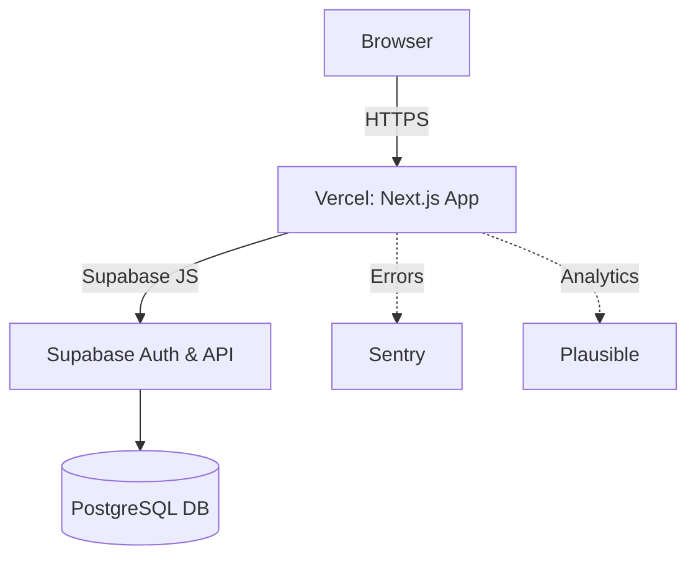

# keep-typing

A free, customizable, minimalistic typing-test web app to practice and improve typing speed and accuracy.

## Tech Stack & Architecture

- Frontend: Next.js (React + TypeScript)
- Styling: Tailwind CSS
- Backend & Auth: Supabase (PostgreSQL)
- Testing: Jest (unit), Cypress (E2E)
- CI/CD: GitHub Actions
- Hosting: Vercel (frontend), Supabase (backend)
- Monitoring: Sentry (errors), Plausible (analytics)



## Getting Started

### Prerequisites
- Node.js ≥16, npm or yarn
- Supabase project (FREE tier)

### Clone & Install
```bash
git clone https://github.com/rohan-patnaik/keep-typing.git
cd keep-typing
npm install
```

### Environment Variables
```bash
cp .env.example .env.local
# then edit .env.local:
# NEXT_PUBLIC_SUPABASE_URL=
# NEXT_PUBLIC_SUPABASE_ANON_KEY=
# SENTRY_DSN= # Your Sentry DSN for server-side errors
# NEXT_PUBLIC_SENTRY_DSN= # Your Sentry DSN for client-side errors
# SENTRY_ORG= # Your Sentry organization slug
# SENTRY_PROJECT= # Your Sentry project slug
```

### Sentry Configuration

For Sentry error monitoring to work, you need to set up the following environment variables:

*   `SENTRY_DSN`: Your Sentry DSN for server-side errors. This should be kept private.
*   `NEXT_PUBLIC_SENTRY_DSN`: Your Sentry DSN for client-side errors. This will be exposed to the browser.
*   `SENTRY_ORG`: Your Sentry organization slug.
*   `SENTRY_PROJECT`: Your Sentry project slug.

You can find these values in your Sentry project settings. Make sure to add them to your `.env.local` file and configure them in your Vercel project settings for production deployments.

### Running Locally
```bash
npm run dev   # http://localhost:3000
```

### Deploying to Vercel

1.  **Install Vercel CLI (if not already installed):**
    ```bash
    npm i -g vercel
    ```
2.  **Login to Vercel:**
    ```bash
    vercel login
    ```
3.  **Deploy your project:**
    ```bash
    vercel
    ```
    Follow the prompts. Vercel will automatically detect it's a Next.js project.
4.  **Configure Environment Variables on Vercel:**
    For your Supabase integration to work in production, you must set the `NEXT_PUBLIC_SUPABASE_URL` and `NEXT_PUBLIC_SUPABASE_ANON_KEY` environment variables directly in your Vercel project settings.
    *   Go to your Vercel project dashboard.
    *   Navigate to **Settings > Environment Variables**.
    *   Add `NEXT_PUBLIC_SUPABASE_URL` and `NEXT_PUBLIC_SUPABASE_ANON_KEY` with their respective values from your Supabase project.
    *   Ensure these are available for the `Production`, `Preview`, and `Development` environments.

    **Important:** Also ensure that your Supabase project's **Redirect URLs** (under Authentication -> Providers -> Google) include your Vercel deployment URL (e.g., `https://your-project-name.vercel.app/auth/callback`).

## Scripts
- `npm run dev` → dev server
- `npm run build` → production build
- `npm start` → serve production build
- `npm run lint` → ESLint
- `npm test` → placeholder (no tests yet)
- `npm run test:e2e` → placeholder (no E2E tests yet)
- `npm run format` → Prettier

## Folder Structure
```plaintext
keep-typing/
├── .github/
│   └── workflows/ci.yml
├── .gitignore
├── .env.example
├── next.config.js
├── package.json
├── postcss.config.js
├── tailwind.config.js
├── tsconfig.json
├── .eslintrc.json
├── .prettierrc
├── src/
│   ├── lib/
│   │   ├── metrics.ts
│   │   └── timer.ts
│   ├── pages/
│   │   ├── _app.tsx
│   │   └── index.tsx
│   └── styles/
│       └── globals.css
└── docs/
    ├── PRD.md
    └── UX_UI_Sketches.md
```