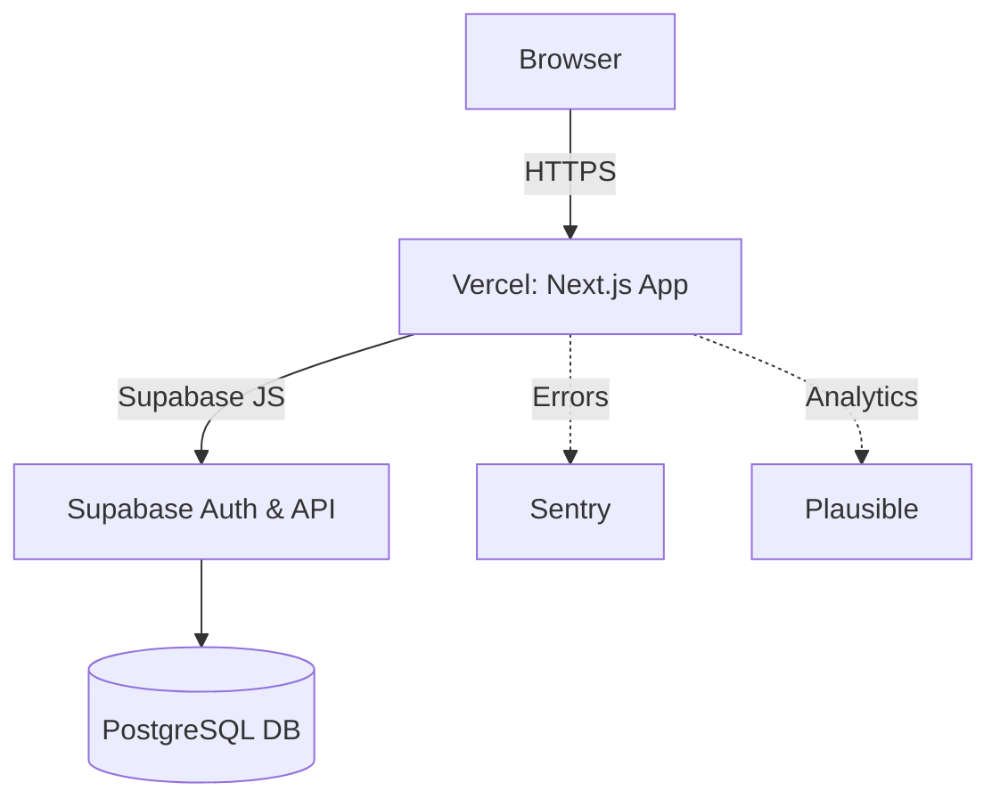

# keep-typing

A free, customizable, minimalistic typing-test web app to practice and improve typing speed and accuracy.

## Tech Stack & Architecture

- Frontend: Next.js (React + TypeScript)
- Styling: Tailwind CSS
- Backend & Auth: Supabase (PostgreSQL)
- Testing: Jest (unit), Cypress (E2E)
- CI/CD: GitHub Actions
- Hosting: Vercel (frontend), Supabase (backend)
- Monitoring: Sentry (errors), Plausible (analytics)



## Getting Started

### Prerequisites
- Node.js ≥16, npm or yarn
- Supabase project (FREE tier)

### Clone & Install
```bash
git clone https://github.com/rohan-patnaik/keep-typing.git
cd keep-typing
npm install
```

### Environment Variables
```bash
cp .env.example .env.local
# then edit .env.local:
# NEXT_PUBLIC_SUPABASE_URL=
# NEXT_PUBLIC_SUPABASE_ANON_KEY=
```

### Running Locally
```bash
npm run dev   # http://localhost:3000
```

## Scripts
- `npm run dev` → dev server
- `npm run build` → production build
- `npm start` → serve production build
- `npm run lint` → ESLint
- `npm test` → placeholder (no tests yet)
- `npm run test:e2e` → placeholder (no E2E tests yet)
- `npm run format` → Prettier

## Folder Structure
```plaintext
keep-typing/
├── .github/
│   └── workflows/ci.yml
├── .gitignore
├── .env.example
├── next.config.js
├── package.json
├── postcss.config.js
├── tailwind.config.js
├── tsconfig.json
├── .eslintrc.json
├── .prettierrc
├── src/
│   ├── lib/
│   │   └── timer.ts
│   ├── pages/
│   │   ├── _app.tsx
│   │   └── index.tsx
│   └── styles/
│       └── globals.css
└── docs/
    ├── PRD.md
    └── UX_UI_Sketches.md
```