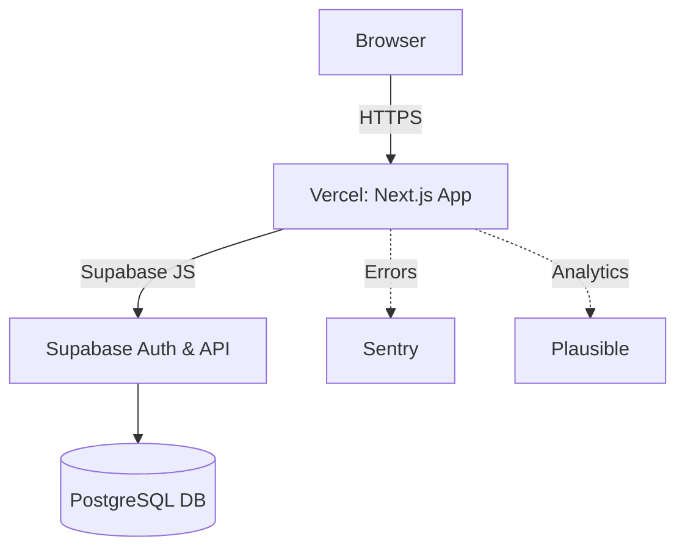

<!-- README.md -->

# keep-typing

A free, customizable, minimalistic typing-test web app to practice and improve typing speed and accuracy.

## Tech Stack & Architecture

- Frontend: Next.js (React + TypeScript)  
- Styling: Tailwind CSS  
- Backend & Auth: Supabase (PostgreSQL)  
- Testing: Jest (unit), Cypress (E2E)  
- CI/CD: GitHub Actions  
- Hosting: Vercel (frontend), Supabase (backend)  
- Monitoring: Sentry (errors), Plausible (analytics)



## Getting Started

### Prerequisites
- Node.js ≥16, npm or yarn  
- Supabase project (FREE tier)

### Clone & Install
```bash
git clone https://github.com/<you>/keep-typing.git
cd keep-typing
npm install
```

### Environment Variables
```bash
cp .env.example .env.local
# then set inside .env.local:
# NEXT_PUBLIC_SUPABASE_URL=
# NEXT_PUBLIC_SUPABASE_ANON_KEY=
```

### Running Locally
```bash
npm run dev   # http://localhost:3000
```

## Database Migrations & Seeding (Optional)
If you opt into Prisma:
```bash
npx prisma migrate dev
npx prisma db seed
```

## Scripts
- `npm run dev` → dev server  
- `npm run build` → production build  
- `npm start` → serve production build  
- `npm test` → unit tests (Jest)  
- `npm run test:e2e` → E2E tests (Cypress)  
- `npm run lint` → ESLint  
- `npm run format` → Prettier

## Deployment & CI/CD
- Push to `main` triggers GitHub Actions: lint, test, build  
- On success, auto-deploy to Vercel

## Folder Structure
```plaintext
keep-typing/
├── .github/
│   └── workflows/ci.yml
├── public/
├── src/
│   ├── pages/        # Next.js routes
│   ├── components/   # UI components
│   ├── lib/          # hooks & utils
│   ├── styles/       # global & module CSS
│   └── types/        # TS interfaces & types
├── cypress/          # E2E tests
├── prisma/           # optional
├── .env.example
├── next.config.js
└── package.json
```
