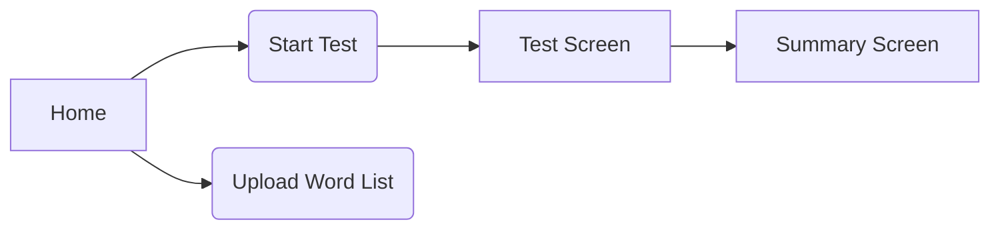

# UX/UI Sketches

## 1. User Flows

## Wireframe Screen sketches

 Create minimal V1 (MVP) and V2 (Enhanced) UI flows with toggleable features, update documentation, and provide implementation-ready ASCII mocks.

---

1. Version-Specific Screen Requirements

V1 (MVP) - 4 Core Screens

1. 

Home Screen

	- Test selection (30s/60s/custom)
	- Basic settings toggles (punctuation/numbers)
	- No V2 toggle yet

	╔═════════════════════════════════════════════════════════════════════════╗
	║ keep-typing                                                             ║
	╠═════════════════════════════════════════════════════════════════════════╣
	║ [30s] [60s] [Custom]                                                    ║
	║ Punctuation: [✓]  Numbers: [ ]                                          ║
	╚═════════════════════════════════════════════════════════════════════════╝

2. 
Auth Screen

	- Google login only

	╔═════════════════════════════════════════════════════════════════════════╗
	║ Sign In                                                                 ║
	╠═════════════════════════════════════════════════════════════════════════╣
	║                                                                         ║
	║                 [ Sign In with Google ]                                 ║
	║                                                                         ║
	╚═════════════════════════════════════════════════════════════════════════╝

3. 
Summary Screen

	- WPM/accuracy results
	- Basic retry/new test actions

	╔═════════════════════════════════════════════════════════════════════════╗
	║ 72 WPM | 96% Accuracy                                                   ║
	╠═════════════════════════════════════════════════════════════════════════╣
	║ █▁▁▁▁▁▁▁▁▁▁▁▁▁▁▁▁▁▁▁▁▁█  (Simple chart)                                 ║
	║ [Retry] [New Test]                                                      ║
	╚═════════════════════════════════════════════════════════════════════════╝

4. 
Leaderboard Screen

	- Global rankings only

	╔═════════════════════════════════════════════════════════════════════════╗
	║ 1. You: 72 WPM                                                          ║
	║ 2. Alice: 70 WPM                                                        ║
	║ 3. Bob: 68 WPM                                                          ║
	╚═════════════════════════════════════════════════════════════════════════╝

V2 (Enhanced) - 5 Screens (V1 + Profile)

1. 

Home Screen

	- Adds V1/V2 toggle
	- Settings remain minimal

	+ ║ [V1 ● ○ V2]  // Toggle visible during development

2. 
Profile Screen (New)

	- User stats/achievements

	╔═════════════════════════════════════════════════════════════════════════╗
	║ rohan_patnaik | Lvl 38                                                  ║
	╠═════════════════════════════════════════════════════════════════════════╣
	║ Tests: 427 | Accuracy: 90%                                              ║
	║ 30s Best: 78 WPM                                                        ║
	║ [██████████ 38% to next level]                                          ║
	╚═════════════════════════════════════════════════════════════════════════╝

–––––––––––––––––––––––––––––––––––––––––––––––––