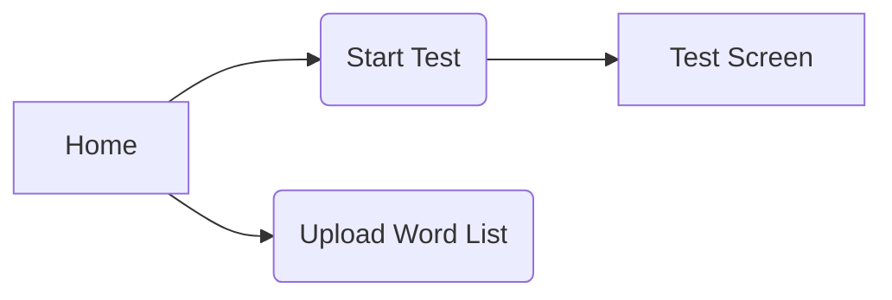

<!-- UX_UI_Sketches.md -->

# UX/UI Sketches



```mermaid
flowchart TB
  subgraph TopBar
    WPM[WPM | Accuracy | Timer]
  end
  subgraph Main
    Text["…typing text…"]
  end
  subgraph Bottom
    Hint["Enter/Esc to start/restart"]
  end
  TopBar --> Main --> Bottom
```

```mermaid
flowchart TB
  S[Summary: WPM | Accuracy] --> C[Chart: WPM over Time]
  C --> B[Retry / New Test]
```

**Notes**  
- Home: select test mode or upload list  
- Test: live stats + typing input  
- Results: metrics + retry/new