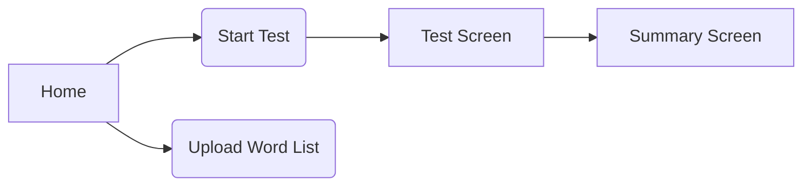

# UX/UI Sketches

## 1. User Flows



## 2. Home Screen (Wireframe)

┌────────────────────────────────────────────┐
│ keep-typing                                │
├────────────────────────────────────────────┤
│ [30 s Test]  [60 s Test]  [Quote Mode]     │
│                                            │
│ [Upload Custom Word List]                  │
├────────────────────────────────────────────┤
│ Light/Dark [●]   Font: [Serif▼]            │
└────────────────────────────────────────────┘

## 3. Test Screen

```mermaid
flowchart TB
  subgraph TopBar
    WPM[WPM | Accuracy | Timer]
  end
  subgraph Main
    Text["…typing text here…"]
  end
  subgraph Bottom
    Hint["Enter: start/pause | Esc: reset"]
  end
  TopBar --> Main --> Bottom
```

## 4. Summary Screen

```mermaid
flowchart TB
  Summary[Summary: WPM | Accuracy] --> Chart[Chart: WPM over Time]
  Chart --> Actions[Retry / New Test]
```