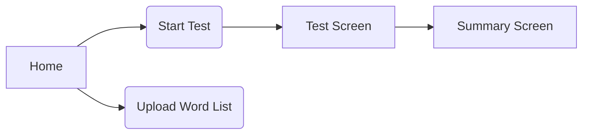

# UX/UI Sketches

## 1. User Flows

## Wireframe Screen sketches

Based on the PRD for v1 (MVP) and v2 (Enhancements), you’ll need to design:
• 4 screens for v1
• 8 additional screens for v2
Total: 12 distinct screens.
Below are ASCII wire-frame mocks for each. After that is a single, detailed “design request” prompt you can feed to your LLM to generate polished UI designs from these mocks.
–––––––––––––––––––––––––––––––––––––––––––––––––

1. v1: MVP SCREENS
Screen 1 – Home / Landing

	+------------------------------------------------+
	| keep-typing                                    |
	|                                                |
	|   [30s Test]  [60s Test]  [Quote Mode]         |
	|                                                |
	|   [Upload Word List]   [Language ▼]            |
	|                                                |
	|   Punctuation: [✓]   Numbers: [ ]              |
	|   Theme: [Light ▼]   Font: [Serif ▼]            |
	+------------------------------------------------+

Screen 2 – Authentication (Sign In / Sign Up)

	+------------------------------------------------+
	| keep-typing    [Switch to Sign Up]             |
	|                                                |
	|  Email:    [________________________]          |
	|  Password: [________________________]          |
	|                                                |
	|  [ Sign In ]                                   |
	|                                                |
	|  Or continue with: [ Google ] [ GitHub ]       |
	+------------------------------------------------+

Screen 3 – Test Screen

	+------------------------------------------------+
	| Time: 30s   |   WPM: 0   |   Accuracy: 0.0%   |
	| [Warning: CapsLock is on]                     |
	|                                                |
	| Hello, world! This is your typing text…        |
	|                                                |
	| > [ your typing goes here…__________________]  |
	|                                                |
	|                   [ Pause ]                    |
	+------------------------------------------------+

Screen 4 – Summary Screen

	+------------------------------------------------+
	|               Test Summary                    |
	|                                                |
	|   Final WPM: 75       Accuracy: 92.3%          |
	|                                                |
	|   Last 10 Results:                             
	|   +------------------------------------------+  |
	|   | 1. 75 WPM | 92.3% | Jan 21              |  |
	|   | 2. 70 WPM | 90.0% | Jan 20              |  |
	|   | …                                        |  |
	|   +------------------------------------------+  |
	|                                                |
	|   [ Retry ]    [ New Test ]                    |
	+------------------------------------------------+

–––––––––––––––––––––––––––––––––––––––––––––––––

1. v2: ENHANCEMENT SCREENS
Screen 5 – Modes & Difficulty

	+------------------------------------------------+
	|              Select Mode & Difficulty         |
	|                                                |
	|  Time Modes:  [ •30s ]  [ 60s ] [ 120s ]        |
	|  Word Modes:  [ •50 ]   [ 75 ]  [ 100 ]         |
	|                                                |
	|  Difficulty:  [ •Easy ] [ Expert ] [ Master ]  |
	|                                                |
	|  [ Apply & Back ]                              |
	+------------------------------------------------+

Screen 6 – Settings (Punctuation, Numbers & Theming)

	+------------------------------------------------+
	|                  Settings                     |
	|                                                |
	|  Toggles:                                     |
	|    • Punctuation   [✓]                         |
	|    • Numbers       [ ]                         |
	|                                                |
	|  Appearance:                                  |
	|    • Theme        [ Light ▼ ] (Dark, Auto)     |
	|    • Font         [ Serif ▼ ] (Sans, Mono)     |
	|                                                |
	|  [ Save & Back ]                               |
	+------------------------------------------------+

Screen 7 – Custom Word List Upload

	+------------------------------------------------+
	|              Upload Custom Word List          |
	|                                                |
	|  Select file: [ Choose file… ]                 |
	|  File name:   my-words.txt                    |
	|                                                |
	|  [ Preview Words… ]                            |
	|                                                |
	|  [ Upload & Apply ]                            |
	+------------------------------------------------+

Screen 8 – Language Selector

	+------------------------------------------------+
	|                Choose Language                |
	|                                                |
	|  [ •English ]  [ Spanish ]  [ French ]         |
	|                                                |
	|  [ Apply & Back ]                              |
	+------------------------------------------------+

Screen 9 – Advanced Analytics

	+------------------------------------------------+
	|                Analytics                      |
	|                                                |
	|  Consistency Score: 85                        |
	|                                                |
	|  Error Heatmap:                               
	|  +------+------+------+                        |
	|  |  a   |  b   |  c   |                        |
	|  +------+------+------+                        |
	|  | ... more rows ...  |                        |
	|  +------+------+------+                        |
	|                                                |
	|  [ Back ]                                      |
	+------------------------------------------------+

Screen 10 – Leaderboards

	+------------------------------------------------+
	|               Leaderboards                    |
	|                                                |
	|  [ Global ]   [ Friends ]                     |
	|                                                |
	|  1. Alice    88 WPM | 95.0%                   |
	|  2. Bob      85 WPM | 93.2%                   |
	|  3. …                                         |
	|                                                |
	|  [ Back ]                                      |
	+------------------------------------------------+

Screen 11 – Theme Builder & Presets

	+------------------------------------------------+
	|               Theme Builder                   |
	|                                                |
	|  Primary Color: [■■■■■■] [ Color Picker ▼ ]     |
	|  Secondary:     [■■■■■■] [ Color Picker ▼ ]     |
	|                                                |
	|  Presets: [ Default ] [ MyPreset ▼ ]           |
	|                                                |
	|  [ Save Preset ]   [ Apply & Back ]            |
	+------------------------------------------------+

Screen 12 – Donation / Monetization

	+------------------------------------------------+
	|            Support keep-typing                 |
	|                                                |
	|  If you enjoy keep-typing, please consider:    |
	|                                                |
	|    [ Patreon ]   [ Ko-fi ]   [ Donate ]         |
	|                                                |
	|  Thank you for your support!                   |
	+------------------------------------------------+

–––––––––––––––––––––––––––––––––––––––––––––––––